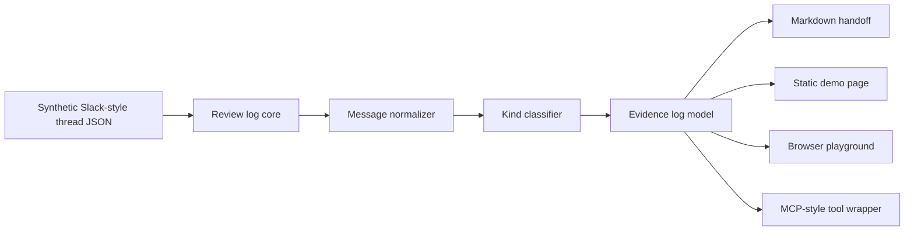
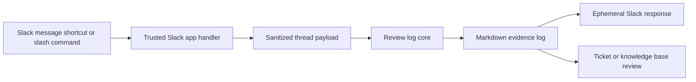
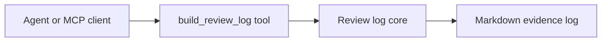

# Architecture

## Current Prototype



The current prototype is intentionally dependency-free. It uses synthetic
Slack-style JSON input so reviewers can inspect the evidence-log workflow
without granting workspace access or exposing private messages.

## Planned Slack Shape



## MCP-Style Tool Shape



The local MCP-style wrapper exposes one tool:

```text
build_review_log
```

It receives a synthetic or sanitized Slack-style thread and returns a text
content item containing the Markdown evidence log.

The Slack app layer should stay thin:

- receive a selected thread or pasted review text,
- remove credentials, customer identifiers, and account-local data,
- call the review-log core,
- return a Markdown handoff for owner review.

## Data Boundary

The project should not store Slack tokens, private workspace exports, customer
support tickets, payment data, cookies, local storage, or account screenshots.
Demo data must remain synthetic or explicitly sanitized.

## Why This Architecture

The evidence-log core is separate from Slack platform code so it can be tested
without OAuth, workspace installation, or private data. That makes the review
logic portable across a slash command, workflow step, message shortcut, or MCP
tool wrapper.
