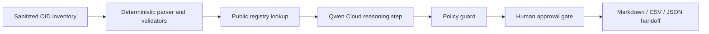

# Qwen Submission Pack

Generated at: 2026-06-28T23:00:57.751Z

## Project

- Name: OID Knowledge Lab: Qwen Remediation Autopilot
- Category: business workflow agent
- Target user: PKI, SNMP/MIB, IAM, and internal registry owners who need a safe OID inventory review path
- Core claim: Turn a sanitized OID inventory into an evidence-backed remediation queue with deterministic checks, Qwen-assisted explanation, and human approval gates.

## Devpost Field Draft

**Tagline:** Qwen-assisted OID remediation handoffs with deterministic registry checks and human approval gates.

**Project pitch:** OID remediation teams often start with messy spreadsheets, unclear private enterprise arcs, and malformed values. This project turns a sanitized OID inventory into a reviewable remediation package: deterministic parsing and registry lookup identify evidence gaps, Qwen summarizes the findings in stakeholder-readable language, and the workflow stops before any external action until a human approves it.

**Built with:** Node.js, static HTML/CSS/JavaScript, public IANA PEN data, OID-base sitemap metadata, DashScope OpenAI-compatible Qwen chat API adapter, Markdown/JSON/CSV artifact generation.

**What it does:** It accepts safe OID inventory input, classifies known enterprise roots and malformed values, generates a remediation queue, drafts reviewer-friendly summaries, and exports public-safe proof artifacts.

**How Qwen is used:** Qwen is used as the language reasoning layer after deterministic classification. It summarizes evidence, explains ambiguous rows, drafts next-action wording, and preserves human approval gates rather than changing production systems or contacting third parties.

**Challenges:** The main challenge is keeping the public demo useful without copying third-party page bodies, exposing customer inventories, or overstating live-cloud proof. The implementation separates deterministic evidence from the Qwen reasoning layer and labels the remaining live-run proof gap explicitly.

## Architecture Diagram

## Three-Minute Demo Script

| Time | Scene | Narration |
|---|---|---|
| 0:00-0:20 | Problem | Show a messy but sanitized OID inventory and explain why malformed values and unclear enterprise roots slow remediation. |
| 0:20-0:45 | Deterministic checks | Run the local assessment to classify valid OIDs, invalid values, public PEN matches, and unresolved items. |
| 0:45-1:20 | Qwen reasoning layer | Show the Qwen adapter request shape and explain that Qwen drafts stakeholder-readable summaries from deterministic evidence. |
| 1:20-1:50 | Human gate | Highlight blocked actions: no vendor contact, ticket creation, registry edits, or customer-facing changes without approval. |
| 1:50-2:35 | Generated handoff | Open the Markdown/CSV/JSON artifacts and show the remediation queue, proof links, and acceptance checks. |
| 2:35-3:00 | Why it matters | Close with the buyer value: faster OID cleanup scoping for PKI, SNMP/MIB, IAM, and registry owners. |

## Proof Checklist

| Item | Status | Evidence |
|---|---|---|
| Offline agent demo | ready | reports/qwen-agent-demo.md |
| Deterministic dataset audit | ready | reports/dataset-manifest.json |
| Public one-link page | ready | https://oid-knowledge-lab.vercel.app/qwen-autopilot-agent-one-link.html |
| Screenshot proof gallery | ready | https://oid-knowledge-lab.vercel.app/qwen-demo-proof.html |
| Architecture diagram | ready | reports/qwen-architecture.mmd |
| Live Qwen run | needs_live_key | Requires DASHSCOPE_API_KEY and redacted response receipt |
| Public demo video | needs_recording | Use the three-minute demo script in this pack |

## Proof Links

- [Qwen one-link packet](https://oid-knowledge-lab.vercel.app/qwen-autopilot-agent-one-link.html)
- [Qwen demo proof page](https://oid-knowledge-lab.vercel.app/qwen-demo-proof.html)
- [Demo proof screenshot](https://oid-knowledge-lab.vercel.app/assets/qwen/demo-proof.png)
- [One-link packet screenshot](https://oid-knowledge-lab.vercel.app/assets/qwen/one-link.png)
- [Architecture screenshot](https://oid-knowledge-lab.vercel.app/assets/qwen/architecture.png)
- [Sample assessment screenshot](https://oid-knowledge-lab.vercel.app/assets/qwen/sample-assessment.png)
- [Sample assessment](https://oid-knowledge-lab.vercel.app/sample-assessment.html)
- [Technical rigor proof](https://oid-knowledge-lab.vercel.app/technical-rigor-proof.html)
- [Qwen agent demo report](https://raw.githubusercontent.com/OOYXLOO/oid-knowledge-lab/main/reports/qwen-agent-demo.md)
- [Qwen adapter source](https://raw.githubusercontent.com/OOYXLOO/oid-knowledge-lab/main/src/qwenAgent.js)
- [Source repository](https://github.com/OOYXLOO/oid-knowledge-lab)

## Public Boundaries

- No secrets or API keys in generated artifacts.
- No raw customer inventories in public pages.
- No copied OID-base page bodies.
- No private account exports, payment data, identity documents, cookies, or OTPs.
- No external action is represented as complete unless a human-approved receipt exists.
